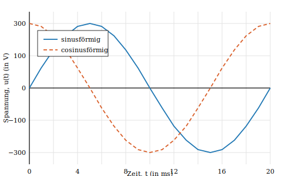

<!-- The title page is rendered by the theme from the frontmatter `data`. The
     body is pure structure: `:::frontmatter` / `:::mainmatter` / `:::appendix`
     switch matter (which drives numbering and the TOC); `:::page` forces a
     break where the engine wouldn't; chapters auto-break. No layout HTML. -->

:::frontmatter

# Kurzreferat

Ein *Kurzreferat* ist eine prägnante Inhaltsangabe, ein Abriss ohne
Interpretation und Wertung einer wissenschaftlichen Arbeit. Kurzreferate können
in vieler Hinsicht verwendet werden, z. B. zur Feststellung von Relevanz: Es
soll schnell und exakt zu erkennen sein, ob das Dokument für die Fragestellung
relevant ist und der Leser das Originaldokument noch lesen muss [@wikipedia-de].

# Abstract

An *abstract* is a brief summary of a research article, thesis, review,
conference proceeding or any in-depth analysis of a particular subject, and is
often used to help the reader quickly ascertain the paper's purpose. When used,
an abstract always appears at the beginning of a manuscript [@wikipedia-en].

:::page

# Text der Aufgabenstellung im Original

*(Hier wird die im Original gestellte Aufgabenstellung eingefügt.)*

:::page

# Eidesstattliche Erklärung

Hiermit versichere ich, die vorliegende Arbeit selbstständig und unter
ausschließlicher Verwendung der angegebenen Literatur und Hilfsmittel erstellt
zu haben.

Die Arbeit wurde bisher in gleicher oder ähnlicher Form keiner anderen
Prüfungsbehörde vorgelegt und auch nicht veröffentlicht.

Musterstadt, den {{.Data.submitted}}

:::page

# Inhaltsverzeichnis

:::toc depth=3

:::page

# Symbolverzeichnis

<dl class="entries"><dt>$a,\ A$</dt><dd>Skalar, auch komplexwertig</dd><dt>$\vec{a},\ \vec{A}$</dt><dd>Vektor, auch komplexwertig</dd><dt>$\eta$</dt><dd>Wirkungsgrad</dd><dt>$\kappa$</dt><dd>Leitfähigkeit</dd></dl>

:::page

# Abkürzungsverzeichnis

<dl class="entries abbr"><dt>DIN</dt><dd>Deutsches Institut für Normung</dd><dt>ISO</dt><dd>Internationale Organisation für Normung, engl. International Organization for Standardization</dd><dt>PDF</dt><dd>(trans)portables Dokumentenformat, engl. Portable Document Format</dd></dl>

:::page

# Abbildungsverzeichnis

:::lof

:::page

# Tabellenverzeichnis

:::lot

:::mainmatter

# Einleitung

Die Einleitung soll den Leser mit dem behandelten Problem bekanntmachen und das
Ziel und die Bedeutung der Arbeit aufzeigen. Weitere mögliche Inhalte einer
Einleitung sind in Abschnitt&nbsp;[#einleitung-1] auf Seite&nbsp;[#einleitung-1 page] beschrieben.

# Richtlinien zur Ausarbeitung

Schriftliche Ausarbeitungen zu Bachelor-, Master- und anderen wissenschaftlichen
Arbeiten sollen nach gewissen für technisch-wissenschaftliche Berichte bewährten
Regeln aufgebaut und gestaltet sein, um den Leser in klarer Form über das
behandelte Thema zu informieren [@lanze1982][@hering2009].

## Aufbau des Berichtes

Berichte zu Bachelor- und Masterarbeiten sollen die nachstehenden Teile in der
angegebenen Reihenfolge enthalten:

- Titelblatt,
- Kurzreferat (deutsch und englisch),
- Erklärung über die Selbständigkeit der Arbeit,
- Inhaltsverzeichnis,
- Formelzeichenliste, Abkürzungs-, Abbildungs- und Tabellenverzeichnis,
- Text des Berichtes mit Einleitung, Hauptteil und Zusammenfassung,
- Literaturverzeichnis sowie Anhänge.

## Inhaltliche Gestaltung des Textes

### Einleitung

Die Einleitung soll den Leser mit dem behandelten Problem bekanntmachen und
beschreibt die Art der gestellten Aufgabe, den Erkenntnisstand, von dem die
Arbeit ausgeht, sowie das Ziel und die Bedeutung der Arbeit.

### Hauptteil

Der Hauptteil enthält eine vollständige Beschreibung der Problemlösung im
Detail. Wesentlicher Gesichtspunkt für die Gestaltung ist die wirksame
Weitergabe der geschriebenen Information an einen fachlich gebildeten Leser, der
nicht unmittelbar mit dem behandelten Problem vertraut ist.

### Zusammenfassung

Die Zusammenfassung als letzter Abschnitt des Textes enthält klare und kritische
Aussagen über die Ergebnisse der Arbeit und ihre Bedeutung sowie die Grenzen der
Gültigkeit.

## Formale Gestaltung des Berichtes

### Äußere Form

Berichte zu Bachelor- und Masterarbeiten sind im Format DIN&nbsp;A4 anzufertigen.
Der Text ist einseitig bei 1½-fachem Zeilenabstand zu schreiben. Bei Textseiten
sind folgende Randbreiten einzuhalten: unten 2,0&nbsp;cm und sonst 2,5&nbsp;cm.

### Formale Textgestaltung

Die Gliederung des Textes ist durch Nummerierung der Abschnitte nach dem
Dezimalnummernsystem zu kennzeichnen. Gleichungen und Formeln sind möglichst auf
eigene Zeilen zu schreiben und am rechten Rand fortlaufend zu nummerieren. Als
Beispiel dient der Satz des Pythagoras

$$
a^2 + b^2 = c^2 \tag{2.1}
$$

den man in Richtung von $a$ oder $b$ umstellen kann.

### Tabellen

Zahlentafeln oder Zusammenstellungen von Daten in Tabellenform sind fortlaufend
zu nummerieren und zu bezeichnen (siehe Tabelle&nbsp;[#tab-raender]). Die Bezeichnung einer
Tabelle steht oberhalb der Tabelle.

:::table #tab-raender
| Position | Seitenrand (in cm) |
| :------- | :----------------: |
| links    | 2,5                |
| rechts   | 2,5                |
| oben     | 2,5                |
| unten    | 2,0                |

Einzuhaltende Seitenränder bei der Erstellung von Bachelor- und Masterarbeiten
:::

### Bilder

Bilder und grafische Darstellungen aller Art sind fortlaufend zu nummerieren und
zu bezeichnen (siehe Abbildung&nbsp;[#fig-spannung]). Bildunterschriften sollen
selbsterklärend sein.

:::figure #fig-spannung

Harmonischer Zeitverlauf einer Spannung mit einer Frequenz von 50&nbsp;Hz und einem Effektivwert von 230&nbsp;V
:::

Mehrere zusammengehörige Abbildungen sollten in Unterabbildungen nebeneinander
oder untereinander gesetzt werden (siehe Abbildung&nbsp;[#fig-neben]).

:::figure #fig-neben

(a) linke Unterabbildung

(b) rechte Unterabbildung

Zwei Unterabbildungen nebeneinander
:::

### Listen

Listen und Einzelnachweise können unnummeriert sein:

- foo
- bar
- foobar

Listen können auch als Aufzählungen nummeriert werden:

1. foo
2. bar
3. foobar

## Weiterführende Literatur

Die wichtigsten DIN-Normen sind in einschlägigen Taschenbüchern zusammengefasst.
Maßgebend ist jeweils die neueste gültige Ausgabe eines Normblattes.

# Zusammenfassung

Die Zusammenfassung ist der letzte Abschnitt des Textes und fasst die Ergebnisse
der Arbeit zusammen (siehe auch Abschnitt&nbsp;[#zusammenfassung] auf
Seite&nbsp;[#zusammenfassung page]).

# Literaturverzeichnis {.unnumbered}

:::bibliography

:::appendix

# Diagramme

Mögliche Inhalte eines Anhangs sowie dessen formale Gestaltung sind in
Abschnitt&nbsp;[#formale-gestaltung-des-berichtes] auf Seite&nbsp;[#formale-gestaltung-des-berichtes page] näher beschrieben.

# Software für die Benutzung des LaTeX-Textsatzsystems

## Microsoft Windows

Für Microsoft Windows wird die Installation einer LaTeX-Distribution wie MiKTeX
sowie eines Editors empfohlen.

## Linux

Alle nötigen Programme sind typischerweise schon vorinstalliert bzw. lassen sich
leicht über den Paketmanager nachinstallieren.

# Checklisten

## Sprache

- [ ] eine automatische Rechtschreibprüfung wurde benutzt
- [ ] ein Kommilitone hat den Text korrekturgelesen
- [ ] der Text ist im Passiv geschrieben

## Formelsatz

- [ ] jede abgesetzte Gleichung ist horizontal zentriert und fortlaufend nummeriert
- [ ] alle Einheiten sind mit aufrechten Buchstaben geschrieben
