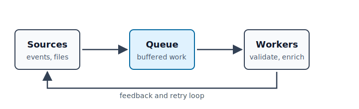

:::frontmatter
# {{.Title}} {.unnumbered .intoc}

*Prepared by {{.Author}} on {{.System.Date}}.*

# Contents

:::toc depth=3

# Figures

:::lof

# Tables

:::lot

:::mainmatter
# Summary

{{.Data.project}} shipped the new ingestion pipeline this sprint. Throughput
improved and the backlog cleared. The report structure follows the idea that
documentation and source should stay close together [@knuth1984].

See the system diagram in Figure [#pipeline] on page [#pipeline page].

:::figure #pipeline

The ingestion pipeline after the queue split.
:::

# Metrics {#metrics}

:::table #slo-table
| Metric       | Last sprint | This sprint |
| :----------- | ----------: | ----------: |
| Throughput/s |       1,200 |       3,400 |
| Error rate   |        2.1% |        0.4% |

Production metrics for the ingestion path.
:::

The error rate in Table [#slo-table] now satisfies $\varepsilon < 0.5\%$:

$$
\varepsilon = \frac{\text{failed requests}}{\text{total requests}} < 0.005
$$

## Checklist {.notoc}

- [x] Ship ingestion v2
- [x] Backfill historical data
- [ ] Decommission the legacy path

## Notes

The legacy path stays online until Q4 for safety[^1].

[^1]: Rollback insurance while v2 soaks in production.

:::appendix
# References

:::bibliography

# Raw details {.unnumbered}

The paged-media theme uses CSS page rules [@css-page].
